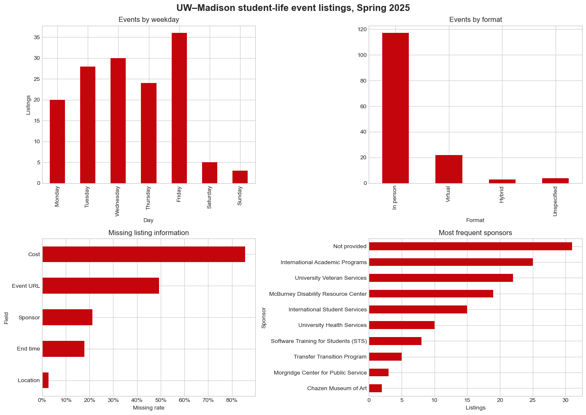
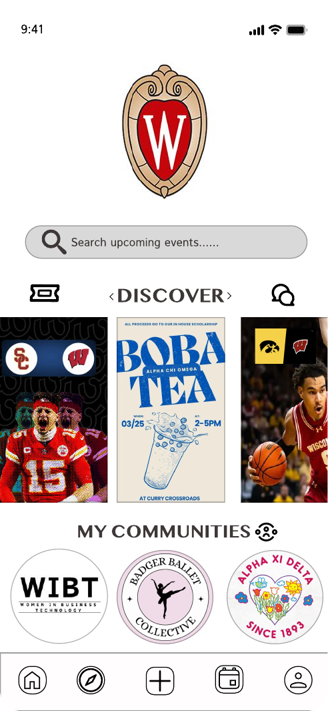
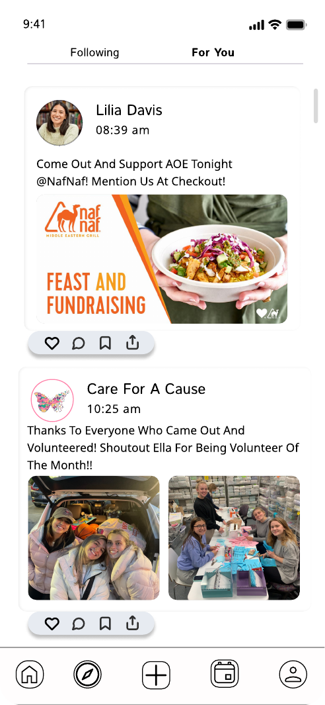
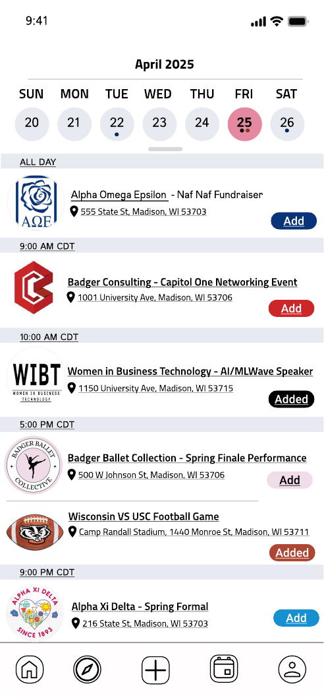
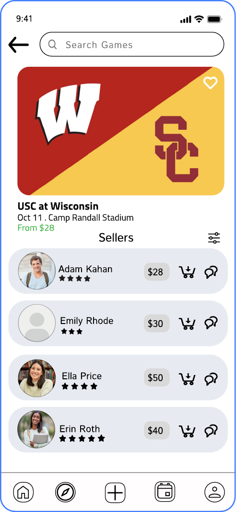
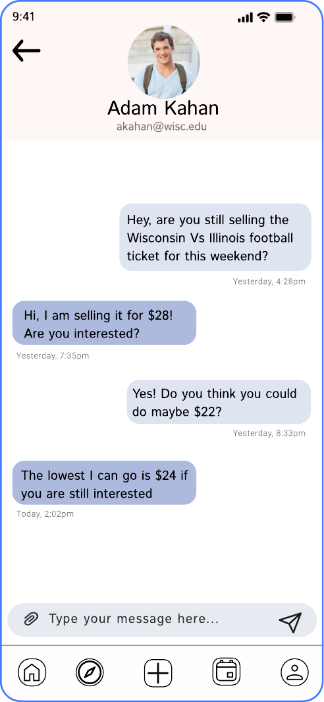
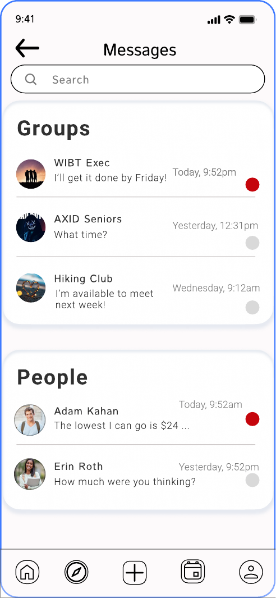
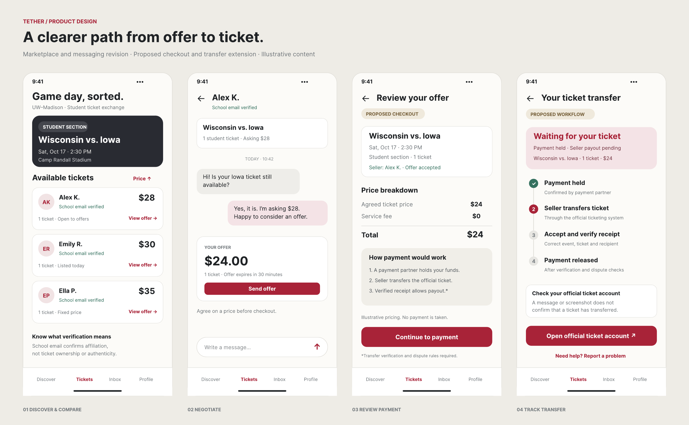
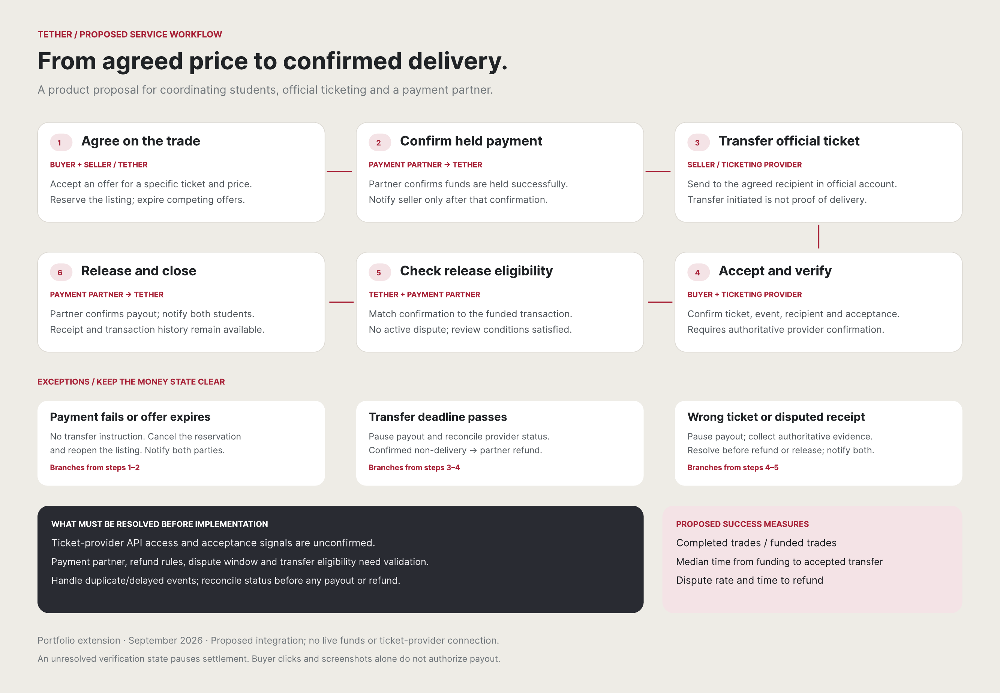

# Tether

A campus engagement case study combining student research, public event data, and product design.

[Interactive Figma prototype](https://www.figma.com/proto/uX5zmjCOw2iQHHnz7TnKym/Portfolio-revision-TETHER?node-id=38-404&scaling=scale-down&content-scaling=fixed&page-id=0%3A1&starting-point-node-id=38%3A404) · [Analysis notebook](tether_event_analysis.ipynb) · [SQL queries](analysis/analysis.sql)



## Summary

UW-Madison students find out about campus events through email, Instagram, group chats and word of mouth. In a survey of 95 students, 80% said they had missed an event because they didn't know it was happening. I wanted to see whether the university's own event calendar closes that gap, so I pulled every event tagged `student life` from the public UW Events API for Spring 2025.

It doesn't, for two reasons:

- **Listings are incomplete.** 86% had no cost, 49% had no event link, and 21% named no sponsor.
- **Most student activity never reaches the calendar.** Only 15 named sponsors appeared across 146 events, and the most frequent were university offices, not student organizations. Active clubs like Women in Business Technology and the Information Systems Society did not appear by name in this sample.

Tether is my proposed fix: one place where verified organizations post complete event details and students find them, with that data shared back to the university.

## At a glance

| Area | Details |
|---|---|
| Role | Product strategy, business analysis, data analysis, UX design |
| Timeline | January to May 2025 as a course project, expanded independently in 2026 |
| Research | 95 survey responses, 10 student interviews |
| Data | 146 UW-Madison student-life event listings from the public API |
| Deliverables | Research synthesis, requirements, roadmap, data analysis, process design, 17-screen prototype |
| Tools | Figma, Python, pandas, PostgreSQL, surveys, interviews, affinity mapping |

## What I did

- Planned and ran the research, then synthesized survey and interview findings through affinity mapping, personas and journey maps
- Built a reproducible Python pipeline for the UW Events API, with validation checks and a saved snapshot
- Wrote PostgreSQL queries for listing quality and duplicate detection
- Defined product requirements, prioritized features and built the roadmap
- Designed all 17 prototype screens, including the trust workflow for a Phase 2 student ticket exchange
- Presented the concept to students, faculty, the course professor and an Information Systems Society panel

## Prototype highlights

| Discovery | Social feed | Calendar |
|---|---|---|
|  |  |  |

| Ticket marketplace | Price negotiation | Messaging |
|---|---|---|
|  |  |  |

### Ticket transaction design





## Requirements traceability

Each requirement traces back to a research theme (listed under Original research below) or a finding from the event data.

| ID | Requirement | Evidence | Phase |
|---|---|---|---|
| R1 | Central search across events and student organizations | Theme 1 (event discovery), Theme 2 (fragmented org information) | Core |
| R2 | Filters for event category and format (in person, virtual, hybrid) | Theme 1; 4 of 146 listings had no identifiable format | Core |
| R3 | Required fields before publishing: sponsor, cost, location, end time, event link | Data: 86% of listings had no cost, 49% no link, 21% no sponsor | Core |
| R4 | Verified organization profiles with a named owner for each listing | Theme 2; hypothesis that clubs lack a clear owner for calendar updates | Core |
| R5 | One submission that publishes to Tether and, through an approved integration, the UW calendar | Themes 3 and 4 (promotion and coordination across platforms); UW Events API is read-only | Core, needs UW partnership |
| R6 | Calendar integration and saved events | Theme 1 | Core |
| R7 | Follows, notifications and personalized recommendations | Themes 1 and 3 | Core |
| R8 | Direct messaging between students and organizations | Theme 4 | Core |
| R9 | Engagement reporting on views, saves, registrations and attendance | Data: the UW API provides listings only, with no engagement data | Core |
| R10 | Coverage reporting by organization and event category | Data: only 15 named sponsors across 146 events; active clubs absent from the sample | Core |
| R11 | School-verified identities, event-specific listings and clear ticket transfer status | Theme 5 (trust and pricing in ticket exchanges) | Phase 2 |

## Full case study

Click any section to expand it.

<details>
<summary><strong>Problem and objective</strong></summary>

<br>

Tether looks at two connected problems. Students struggle to find campus opportunities, and student-organization activity is not consistently captured in the university's central records. That limits both student access and the university's ability to understand campus engagement.

UW-Madison students rely on disconnected channels to take part in campus life: email, social media, university directories, messaging apps and word of mouth. As a result:

- Event and organization information can be hard to find.
- Published listings may be incomplete.
- Students miss relevant opportunities.
- Organization leaders have to promote the same activity on several platforms.
- University reporting can leave out activity that was never submitted or tagged consistently.
- Informal ticket exchanges create trust and coordination risks.

**Objective:** a centralized campus-engagement concept that improves discovery, information quality, coordination and trust, while producing more complete data for student organizations and university reporting.

**Approach:**

```text
Student research
-> qualitative synthesis
-> public-data analysis
-> problem definition
-> requirements development
-> feature prioritization
-> prototype design
-> evaluation
-> measurement planning
```

</details>

<details>
<summary><strong>Original research</strong></summary>

<br>

- 95 student survey responses, collected through the Information Science mailing list and course network
- 10 student interviews
- Affinity mapping to find recurring needs and pain points
- Personas and journey maps
- Findings translated into product requirements

Five recurring themes shaped the product direction:

1. Difficulty discovering relevant campus events
2. Fragmented information about student organizations
3. Ineffective event-promotion channels
4. Coordination across multiple communication platforms
5. Trust and pricing concerns in student ticket exchanges

</details>

<details>
<summary><strong>Public event-data analysis</strong></summary>

<br>

To test the research findings against real data, I retrieved public event records from the UW-Madison Events Calendar API: 146 events tagged `student life` between January 1 and May 31, 2025.

The Python notebook:

1. Requests paginated JSON data from the public API.
2. Saves a reproducible snapshot after removing contact details not needed for the analysis.
3. Deduplicates events by event ID.
4. Standardizes dates, locations, formats, sponsors and tags.
5. Validates and analyzes the processed data.
6. Saves the cleaned data as a CSV for reuse in SQL, Excel, Tableau or Power BI.

The notebook uses the saved snapshot by default, so its results stay reproducible. A documented switch turns on a fresh API request.

**Findings**

- Friday had the most listings, with 36 events.
- Only eight events were listed on weekends.
- 21.2% of listings did not name a sponsor.
- 49.3% had no external event URL.
- 85.6% did not state a cost.
- 117 events were in person, 22 virtual, three hybrid and four unspecified.
- Only 15 named sponsors appeared across the dataset.

These findings describe the availability and completeness of published listings. They do not measure attendance, preferences or demand.

</details>

<details>
<summary><strong>How events reach the calendar, and what gets missed</strong></summary>

<br>

**Current submission process.** Campus events are added through `admin.today.wisc.edu`. An organizer signs in with a UW NetID, enters the event details, selects tags, chooses whether to share the event with campus, and saves it. The tags decide which public calendars and feeds can show the event. It is a manual publishing process. The public API distributes submitted listings but does not accept new ones.

**Reporting gap.** This dataset is a small slice of campus activity. Student organizations known to be active during the project period, including Women in Business Technology and the Information Systems Society, did not appear by name in this tagged sample.

That does not prove they never appeared elsewhere in the UW calendar, since the sample only covers events tagged `student life`. It does show that central reporting depends on organizations submitting events, completing the fields and applying the right tags. Anything outside that process stays invisible to university reporting.

Likely barriers include limited awareness of the calendar, no clear owner for it within a club, duplicate work across email and social channels, missing or inconsistent tags, and events meant only for a private group. These are hypotheses, not measured findings, and would need to be checked with organization leaders and university administrators.

</details>

<details>
<summary><strong>Product response</strong></summary>

<br>

Tether covers three connected product areas, with ticket exchange designed later as Phase 2.

**Campus discovery**
- Central event and organization search
- Event-category and format filters
- Standardized listing information
- Personalized discovery
- Calendar integration

**Student engagement**
- Verified organization profiles
- Organization posts and updates
- Personalized campus content
- Direct messaging
- Follows and notifications

**Data and reporting**
- Required event and organization fields
- Verified organization ownership
- Validation before an event is published
- Reporting on views, saves, registrations and attendance
- Coverage reporting by organization and event category

**Phase 2: trusted ticket exchange**
- School-verified student identities
- Event-specific ticket listings
- Seller context and pricing
- In-app negotiation
- Clear transaction and transfer status
- Proposed refund and dispute handling

</details>

<details>
<summary><strong>Proposed UW partnership</strong></summary>

<br>

The public UW Events API is read-only. Tether could pull calendar listings but could not add records through it, so direct submission or syncing would need a university partnership.

Under the proposed model, verified organizations submit complete event details through Tether. An approved integration shares validated listings with the UW Events Calendar, and Tether separately records student interactions such as views, saves, registrations and attendance. The university would see both what was published and how students actually engaged with it.

What each group gets:

- **UW-Madison:** broader event coverage, more consistent records, and better evidence for scheduling, outreach and student-engagement decisions.
- **Student organizations:** one structured submission process, wider reach, and feedback on which listings draw interest.
- **Students:** a more complete and trustworthy place to find events and get relevant recommendations.

Before implementation, both sides would need to agree on submission approval, data ownership, privacy and retention, duplicate handling, sync timing, and whether engagement data can be shared in aggregate.

Current UW documentation: [event-submission guidance](https://kb.wisc.edu/communications/149248) · [UW Events API](https://today.wisc.edu/api-docs/)

</details>

<details>
<summary><strong>Evaluation and next steps</strong></summary>

<br>

The concept and prototype were reviewed by students, faculty, the course professor and an Information Systems Society panel. Tether was evaluated as a product concept, not a deployed app. Payment processing, ticket-provider integration, recommendations and real-time messaging remain proposed capabilities.

**Next steps**
- Define a standardized data model for event listings.
- Explore a formal UW partnership for verified organizations and event-data integration.
- Set data governance, privacy, approval and system-ownership requirements.
- Add acceptance criteria and priority to each requirement in the traceability table.
- Refine the main prototype workflows.
- Build the product measurement and validation plan.

</details>

## Limitations

- The dataset covers about one semester and only listings tagged `student life`.
- Inclusion depends on manual submission and correct tagging.
- Organizations may appear under different sponsor names or promote events outside the calendar.
- An organization missing from the sample does not mean it was inactive.
- Historical listings may have been edited, and recurring events may appear more than once.
- The API provides listing information, not attendance or engagement data.

## Run the analysis

Install the packages in `requirements.txt`, open `tether_event_analysis.ipynb` in Jupyter, and run the cells from top to bottom. The notebook uses the saved JSON snapshot by default and writes the cleaned CSV to `data/processed/`.

The optional PostgreSQL queries are in [`analysis/analysis.sql`](analysis/analysis.sql).
